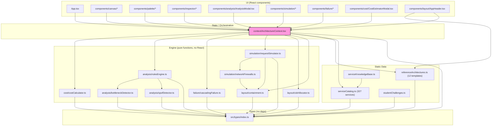
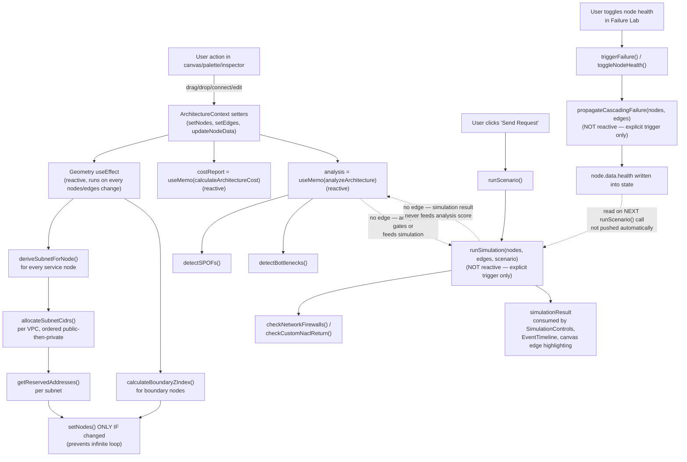
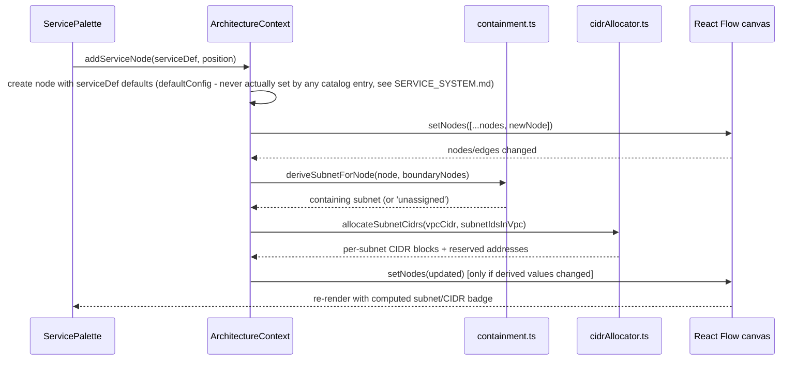

# CURRENT_ARCHITECTURE_DIAGRAM.md

Rendered from actual imports/call sites confirmed by reading source, not from intended design. See `ARCHITECTURE.md` §3 for the prose walkthrough this diagram encodes.

## 5.1 Module dependency graph

**Confirmed**: `ArchitectureContext.tsx` is the single choke point. No UI component imports an engine file directly (verified by grep across `src/components/**` for `from '../../engine` / `from '../../data`; the only exception is `AppHeader.tsx` importing `REFERENCE_ARCHITECTURES` directly to render the template dropdown — a read of static data, not engine logic).

## 5.2 Runtime data flow (what actually triggers what)

**Two confirmed facts that contradict a "pipeline" mental model:**
1. Analysis/Cost/Geometry are reactive (`useMemo`/`useEffect`); Simulation and Failure-injection are imperative (fire only on explicit user action). Nothing in this app runs "UI → State → Simulation → Analysis" as one automatic chain.
2. The only cross-engine data edge that exists is **Failure → Simulation** (a node's `health` field, once set by the Failure Lab, is read and hard-fails a step inside `requestSimulator.ts` on the next simulation run). Simulation results are never read by the analysis engine, and analysis results never gate or alter a simulation. Cost is fully independent of both.

## 5.3 Per-node lifecycle (single service node, from drop to render)

