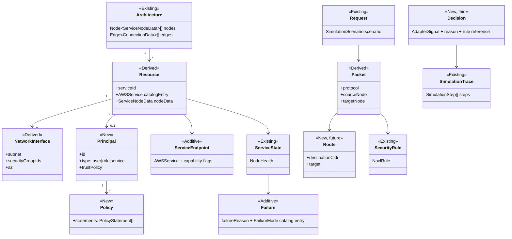

# Domain Model

Status: design only. This document defines the vocabulary the other target-architecture docs use.
Per `SIMULATION_ENGINE_ARCHITECTURE.md`'s non-goals, **this is not a second architecture model.**
Every type below is classified as one of:

- **Existing** — already a type in `src/types/index.ts`, reused verbatim.
- **Derived** — computed on demand from existing canvas state; never stored, never a new field the
  UI has to keep in sync.
- **Additive** — a small new field/interface that extends an existing type without changing its
  current shape; every existing reader keeps working unmodified.
- **New** — a genuinely new concept (only needed for IAM and, later, Route Tables), introduced as its
  own module and only ever *referenced by id* from existing node/edge data, never replacing it.



## 1. Architecture — **Existing**

```ts
nodes: Node<ServiceNodeData>[]
edges: Edge<ConnectionData>[]
```

No change. This is the one source of truth today (`ArchitectureContext`) and stays so through every
phase of the migration. Every other type in this document is either read from it directly or derived
from it without being persisted anywhere new.

## 2. Resource — **Derived**

A "Resource" is the pairing of one canvas node's live data with its static catalog definition — not a
new stored object, just a named concept for "the thing a hop is currently evaluating":

```ts
interface Resource {
  node: Node<ServiceNodeData>;       // existing
  catalogEntry: AWSService;          // existing, looked up from serviceCatalog.ts by serviceId
}
```

Today this pairing is implicit — every adapter re-looks-up `node.data.serviceId` against hardcoded
string arrays. The Service Behavior Engine (`SERVICE_ENGINE.md`) formalizes "Resource" as the argument
its per-service modules receive, but it is computed fresh per hop from existing data, never cached in
a new field.

## 3. Principal — **New**

Does not exist today (`IAM_GAPS.md`: Roles rated CRITICAL/MISSING). Modeled per `IAM_BEHAVIOR.md` §§1,
7–8, 12, 14:

```ts
interface Principal {
  id: string;
  kind: 'user' | 'role' | 'service' | 'account';
  trustPolicy?: Policy;              // required if kind === 'role' (who can assume it)
  identityPolicies: Policy[];
  permissionsBoundary?: Policy;
  sessionPolicy?: Policy;
}
```

A `Principal` is attached to a `Resource` the same way a Security Group is attached today — by an
explicit id reference on the node's data (mirroring `ServiceNodeData.securityGroupIds`), never by
canvas position or an edge to a decorative IAM node. This directly fixes the Thumbnail Generator gap:
an IAM node stops being connective-tissue-only and becomes a real `Principal` record a `Resource`
points to.

**Additive field on `ServiceNodeData`:**
```ts
principalId?: string;   // new, optional — parallels securityGroupIds; absent = today's behavior (no IAM evaluation)
```

## 4. NetworkInterface — **Derived**

Everything AWS would attach to an ENI, computed from existing containment/config data, never stored
separately:

```ts
interface NetworkInterface {
  subnet: SubnetType;                          // existing field, existing derivation (containment.ts)
  securityGroupIds: string[];                  // existing field
  az: AvailabilityZone;                         // existing field
  hasEni: boolean;                              // derived: SUBNET_REQUIRED_SERVICE_IDS membership
}
```

`hasEni` names an existing distinction (`containment.ts`'s comment on `privatelink` vs.
`s3_gateway_endpoint`) that today is only implicit in which array a serviceId appears in. Naming it
is prep for `NETWORK_ENGINE.md`'s declarative `ServiceEndpoint` capability flags.

## 5. Request / Packet — **Existing / Derived**

```ts
Request  = SimulationScenario;    // existing, unchanged
Packet   = { protocol: ProtocolType; source: Resource; target: Resource };   // derived per hop
```

`SimulationScenario` already carries everything a "Request" needs (method, path, startNodeId,
trafficLevel). `Packet` names the per-hop (source, target, protocol) triple that
`pushFirewallBlockIfAny` and the adapters already compute inline — again, a name, not a new stored
type.

## 6. Route — **New, future (Phase 4 only)**

Explicitly out of scope for near-term implementation (refactor plan item 13's own framing). Modeled
here only so the Network Engine's design has a documented extension point:

```ts
interface RouteTable {
  id: string;
  routes: Route[];
}
interface Route {
  destinationCidr: string;            // e.g. '0.0.0.0/0', '10.0.0.0/16'
  target: { type: 'igw' | 'nat' | 'local' | 'vpce' | 'peering' | 'tgw'; targetId: string };
}
```

Until Phase 4, the Network Engine keeps deriving public/private/reachability from subnet-boundary
containment and serviceId membership, exactly as `containment.ts` and `networkPathAdapter` do today —
`Route`/`RouteTable` are not implemented, just reserved names so a future route-table entity doesn't
collide with this vocabulary.

## 7. SecurityRule — **Existing**

```ts
NaclRule           // existing, unchanged
SubnetNaclConfig   // existing, unchanged
```

No new type. `NETWORK_ENGINE.md` reuses these as-is — the NACL/Security-Group evaluation logic
already in `networkFirewalls.ts` becomes the Network Engine's NACL/SG stages with no data-shape
change.

## 8. Policy — **New**

```ts
interface PolicyStatement {
  effect: 'Allow' | 'Deny';
  actions: string[];           // e.g. ['s3:GetObject'], supports '*' suffix wildcard only
  resources: string[];         // resource ids or '*'
  condition?: Record<string, unknown>;   // scoped to the operators enumerated in IAM_BEHAVIOR.md §4
}
interface Policy {
  id: string;
  kind: 'identity' | 'resource' | 'trust' | 'scp' | 'boundary' | 'session';
  statements: PolicyStatement[];
}
```

Directly models `IAM_BEHAVIOR.md` §§4–8. Deliberately narrower than real AWS IAM (no policy
variables, no NotAction/NotResource, no cross-account ARNs beyond a same-simulator "account" concept)
— scoped to what `IAM_ENGINE.md`'s evaluator needs to reproduce the documented 8-step evaluation
order, not a general-purpose policy language (see non-goals in
`SIMULATION_ENGINE_ARCHITECTURE.md` §4).

## 9. ServiceEndpoint — **Additive**

```ts
interface ServiceEndpointCapabilities {
  requiresEni: boolean;          // replaces SUBNET_REQUIRED_SERVICE_IDS membership test
  isIngressProxy: boolean;       // replaces INGRESS_PROXY_SERVICE_IDS membership test
  isManagedEventTarget: boolean; // replaces MANAGED_EVENT_TARGET_SERVICE_IDS membership test
  isVpcEndpoint: 'gateway' | 'interface' | null;
}
```

An additive block on `AWSService` (`src/data/serviceCatalog.ts`), populated once per service
definition instead of being re-derived via ad hoc string-array membership checks scattered across
`containment.ts` and `networkPathAdapter.ts`. This is the single most important refactor named in
`SIMULATION_ENGINE_ARCHITECTURE.md` §1's problem #1 — see `NETWORK_ENGINE.md` §3 and
`MIGRATION_PLAN.md` Phase 3.

## 10. ServiceState — **Existing**

```ts
NodeHealth = 'healthy' | 'degraded' | 'failed'   // existing, unchanged
```

## 11. Failure — **Additive**

```ts
interface FailureMode {
  id: string;
  serviceId: string;
  description: string;          // sourced from AWSService.failureModes, already existing per-service data
  detectionSystem: 'elb_health_check' | 'asg_health_check' | 'ecs_scheduler' | 'manual';
}
```

Names the "three independent health systems" finding from `FAILURE_BEHAVIOR.md` (ELB target-health vs.
ASG health vs. ECS-scheduler health) as a real field (`detectionSystem`) instead of leaving it
implicit in adapter narration string-building, which is what today's `loadBalancerAdapter` does by
branching on `failedTargets[0].data.serviceId` inline.

## 12. Decision — **New, thin**

```ts
type Decision =
  | { kind: 'advance'; nextNode: Node<ServiceNodeData>; reason: string; ruleRef?: string }
  | { kind: 'terminate'; statusCode: number; reason: string; ruleRef?: string }
  | { kind: 'continue' };
```

A renamed, slightly enriched `AdapterSignal` (existing, in `adapters/types.ts`) — adds an optional
`ruleRef` (a pointer into `docs/aws-behavior/AWS_BEHAVIOR_MATRIX.md`, e.g. `"NACL-3"`) so the Trace
Engine can surface which documented AWS rule justified a decision. See `TRACE_ENGINE.md`.

## 13. SimulationTrace — **Existing**

```ts
SimulationTrace   // existing class, src/engine/simulation/adapters/types.ts
SimulationStep    // existing interface, src/types/index.ts
```

No structural change required to adopt the target architecture; `TRACE_ENGINE.md` proposes one
additive optional field (`decision`) on `SimulationStep.details`.

## Summary: what actually gets added to `src/types/index.ts`

Everything else in this document is either reused unchanged or computed on the fly. The only new
surface added to shared types, across every phase, is:

```ts
// Additive to ServiceNodeData
principalId?: string;

// Additive to SimulationStep.details
decision?: { ruleRef?: string; evaluatedBy: 'network' | 'iam' | 'service' | 'failure' };

// New, standalone modules — not merged into src/types/index.ts, live in their own engine folders
Principal, Policy, PolicyStatement   // src/engine/iam/types.ts (Phase 5)
Route, RouteTable                    // src/engine/network/types.ts (Phase 4)
ServiceEndpointCapabilities          // src/data/serviceCatalog.ts additive field (Phase 3)
```
