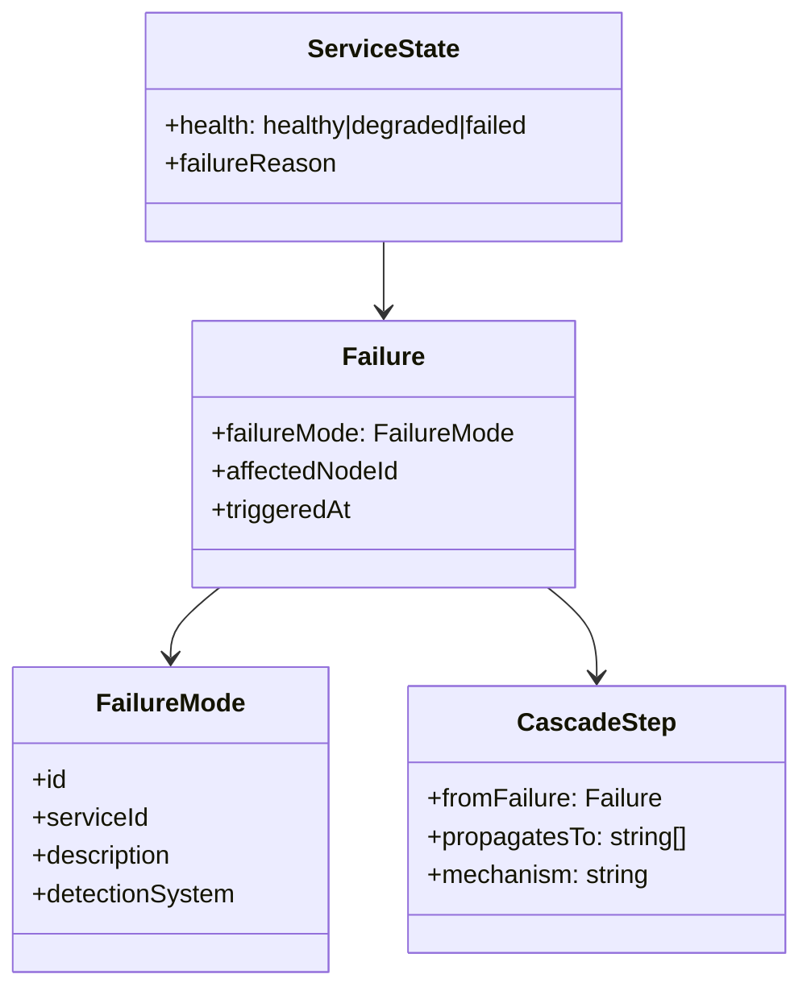
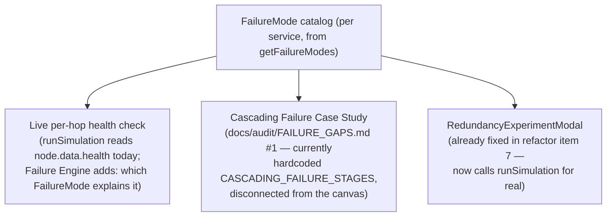
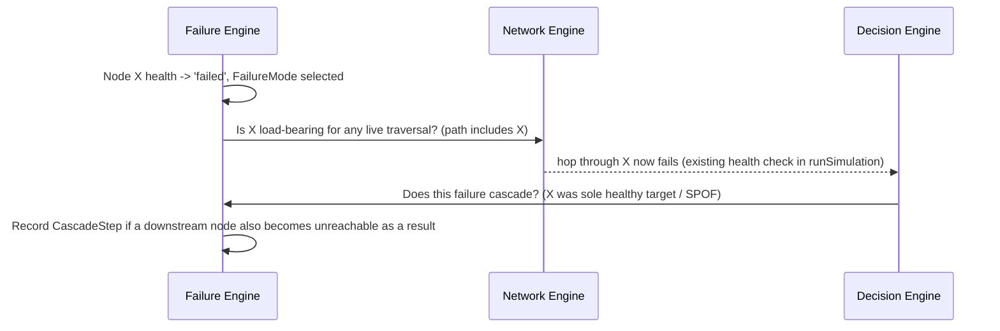

# Failure Engine

Status: design only. Unifies today's live health-mutation mechanics (which are correct — rated
CORRECT in `docs/audit/FAILURE_GAPS.md`) with the currently-disconnected narrative failure-mode
tooling (`CASCADING_FAILURE_STAGES`, the Cascading Failure walkthrough, `RedundancyExperimentModal`),
so both draw from the same `FailureMode` catalog instead of one being canvas-driven and the other
being a hardcoded story.

## 1. Scope: three independent health systems

`docs/aws-behavior/FAILURE_BEHAVIOR.md`'s headline fact, carried forward as the Failure Engine's
central data model:

| System | What it watches | AWS mechanism | Current code |
|---|---|---|---|
| ELB target-health | Individual registered targets behind an ALB/NLB | Target Group health checks, independent per target | `loadBalancerAdapter`'s `targetsEvaluated` |
| ASG health | EC2 instances in an Auto Scaling Group | ASG health check (EC2 status checks or ELB health check, configurable), triggers replace | `computeCapacityAdapter` (`ec2_auto_scaling`) |
| ECS-scheduler health | Tasks in an ECS/Fargate service | ECS service scheduler, independent of any ELB target-health | `computeCapacityAdapter` (`auto_scaling_mgmt`) |

These three are AWS's own reality: a target can be "unhealthy" to its ALB, its instance can
simultaneously be "healthy" to its ASG, and both are independent of a co-located ECS service's own
scheduler state. Refactor item 11 corrected the simulator's *narration* to disambiguate which system
is talking; this document's `detectionSystem` tag (`DOMAIN_MODEL.md` §11) makes that disambiguation a
real field instead of a string branch on `serviceId`.

## 2. Model



```ts
interface FailureMode {
  id: string;
  serviceId: string;
  description: string;              // sourced from AWSService.failureModes (already exists per-service)
  detectionSystem: 'elb_health_check' | 'asg_health_check' | 'ecs_scheduler' | 'manual';
}

interface Failure {
  failureMode: FailureMode;
  affectedNodeId: string;
  triggeredAt: number;               // trace.currentTimestamp when it fired
}
```

`ServiceState` stays exactly `NodeHealth` (`'healthy' | 'degraded' | 'failed'`) plus the existing
`failureReason` string field — no change. `Failure`/`FailureMode` are the new layer that explains
*why* a node is in that state, in a form the Trace Engine can cite via `ruleRef`/`evidence`
(`TRACE_ENGINE.md` §2).

## 3. Live simulation vs. narrative walkthrough: one catalog, two consumers



Today, `FailureControls.tsx`'s "Cascading Failure Walkthrough" (relabeled to "Case Study: Cascading
Outage" per refactor item 5, track a) is a fixed narrative that does not read the user's actual
`nodes`/`edges` — `FAILURE_GAPS.md` rates this CRITICAL/MISSING precisely because a walkthrough that
looks connected to your architecture but isn't is worse than one that's honestly a canned case study.
Refactor item 5 fixed the honesty problem (relabeling + disclaimer). This engine design is what would
fix the underlying gap for real: driving the walkthrough off the same `FailureMode` catalog and the
same `runSimulation` call `RedundancyExperimentModal` now uses (refactor item 7), so the "case study"
becomes an actual simulation of a cascading scenario on the user's own canvas, not prose.

## 4. Cascade propagation



This formalizes what `SimulationResult.cascadeOccurred`/`bottlenecksDetected` already flag today, and
gives the SPOF-detection analysis (`ArchitectureAnalysis.spofs`, static/pre-simulation) a documented
seam to eventually interact with live per-request failure (`FAILURE_GAPS.md` #6, rated LOW/APPROXIMATION
— "SPOF-detection-vs-dynamic-failure non-interaction," explicitly scoped as acceptable for now, not a
blocker for this design).

## 5. What does NOT change

- `NodeHealth`, `failureReason`, and the existing health check inside `runSimulation`'s hop loop
  (`currentNode.data.health === 'failed'` → `trace.fail(503, ...)`) — untouched.
- RDS/Aurora Multi-AZ failover timing and DynamoDB/Aurora unconditional replication behavior
  (`FAILURE_BEHAVIOR.md`'s per-component table) — already correctly modeled via
  `dataTierInteractionAdapter`'s `trace.markSuccess(...)` branches (`TRACE_ENGINE.md` §2's worked
  example describes the parallel pattern for network decisions); this engine just adds the
  `FailureMode`/`detectionSystem` tag on top, it doesn't re-model the failover mechanics.
- `RedundancyExperimentModal.tsx`'s already-completed wiring to `runSimulation` (refactor item 7)
  stays as the working example this whole document generalizes from.

## 6. Non-goal

Not a general-purpose chaos-engineering fault-injection framework. Scoped exactly to the failure
modes already enumerated per-service in `serviceCatalog.ts`'s `AWSService.failureModes` and the
patterns documented in `FAILURE_BEHAVIOR.md` (connection-pool exhaustion, thread-pool exhaustion,
health-check-sharing anti-pattern, thundering herd) — not an open-ended new failure taxonomy.
