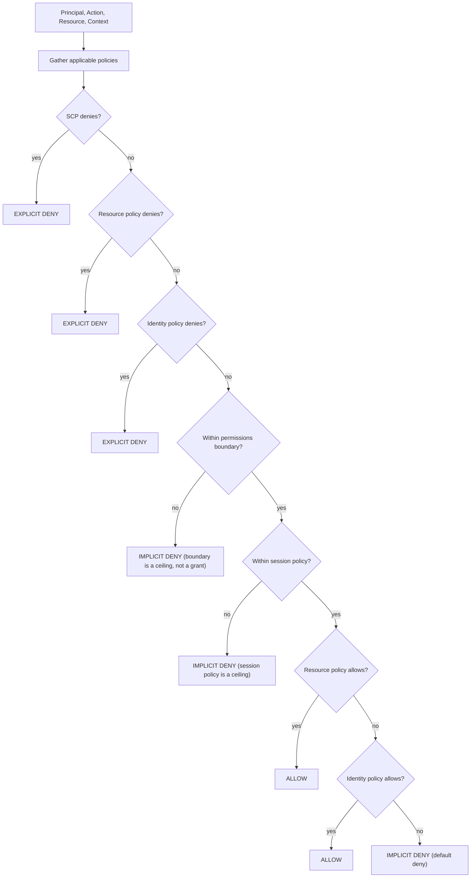
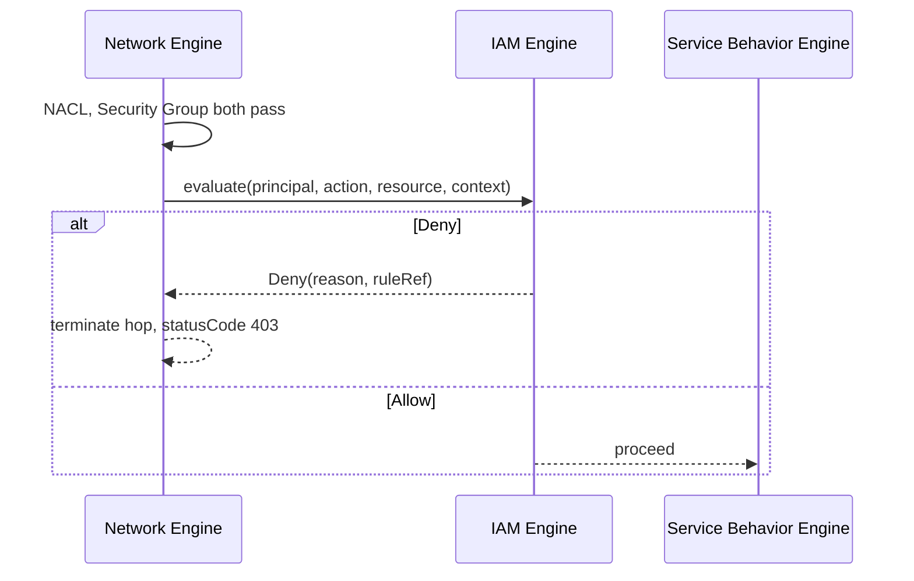

# IAM Engine

Status: design only, net-new subsystem. `docs/audit/IAM_GAPS.md` rates every IAM construct
(Roles, Trust policies, Identity policies, Resource policies, Explicit deny, Implicit deny,
Conditions, Resource matching, Action matching, Role assumption) as **MISSING**. This document is
the design for closing that gap — refactor plan item 14, deliberately not attempted during the
items-1–12 implementation pass, and not to be started without this design being reviewed first.

## 1. Evaluator pipeline

Directly implements the 8-step composite rule documented in `docs/aws-behavior/IAM_BEHAVIOR.md` §15:



Explicit deny always wins, at any stage it's found — this is why the four deny checks run before any
allow check, matching `IAM_BEHAVIOR.md` §9's "explicit deny always wins" rule and §12/§13's
boundary/SCP-as-ceiling framing.

## 2. Interface

```ts
interface AuthorizationRequest {
  principal: Principal;          // DOMAIN_MODEL.md §3
  action: string;                // e.g. 's3:GetObject', 'dynamodb:Query'
  resource: Resource;             // DOMAIN_MODEL.md §2 — the target node/service being accessed
  context?: Record<string, unknown>;  // condition-key values: source IP, time, tags, ...
}

type AuthorizationDecision =
  | { effect: 'Allow' }
  | { effect: 'Deny'; reason: 'explicit-deny' | 'implicit-deny'; source: PolicyReference; ruleRef: string };

function evaluate(request: AuthorizationRequest): AuthorizationDecision;
```

`ruleRef` points into `docs/aws-behavior/AWS_BEHAVIOR_MATRIX.md`'s IAM rows (e.g. `"IAM-9"` for the
explicit-deny-wins rule), so every authorization step in the trace can cite the documented AWS rule
it applied — the same pattern `TRACE_ENGINE.md` uses for network decisions.

## 3. Action and resource matching

Scoped to what `IAM_BEHAVIOR.md` §§2–3 actually document as commonly used, not the full AWS policy
grammar (see `SIMULATION_ENGINE_ARCHITECTURE.md` §4 non-goals):

- **Action matching**: exact string match, or a single trailing-`*` wildcard (`s3:*`, `dynamodb:Get*`).
  No `NotAction`.
- **Resource matching**: exact resource id match, `*` (all resources), or a resource-category
  wildcard scoped to one service (`arn:sim:s3:::*` matches any S3 bucket node). No `NotResource`, no
  ARN path-segment wildcarding beyond this.
- **Condition evaluation**: a fixed, documented set of condition keys — this design does not attempt
  to support the full IAM condition-operator catalog. Exactly which keys are supported is a decision
  for the implementation phase design review (`MIGRATION_PLAN.md` Phase 5), not fixed here.

## 4. Where this plugs into the Network Engine

IAM authorization runs once per hop, after Security Group evaluation and before service behavior
(`NETWORK_ENGINE.md` §1's pipeline position) — a request that's network-reachable but not authorized
still fails, and a request that's authorized but not network-reachable never gets this far, matching
real AWS where network and identity are independent, both-required gates.



A resource with no `principalId` set (`DOMAIN_MODEL.md` §3) skips this stage entirely — behaves
exactly as today (no IAM evaluation), which is what makes this additive rather than breaking for
every existing reference architecture that has never set up IAM.

## 5. Role assumption (`sts:AssumeRole`)

Modeled per `IAM_BEHAVIOR.md` §8: a `Principal` of kind `'role'` requires a `trustPolicy` whose
statements name which other principals may assume it. The evaluator's "gather applicable policies"
step (pipeline diagram, top box) resolves the assuming principal's *effective* policy set by walking
`assumedRole → trustPolicy check → role's own identity policies`, not the original caller's policies
— matching the real AWS behavior that assuming a role swaps your effective permissions rather than
adding to them.

```ts
interface Principal {
  id: string;
  kind: 'user' | 'role' | 'service' | 'account';
  trustPolicy?: Policy;              // required when kind === 'role'
  identityPolicies: Policy[];
  permissionsBoundary?: Policy;
  sessionPolicy?: Policy;
}
```

## 6. What this replaces (and what it doesn't)

| Before | After |
|---|---|
| IAM node on canvas is decorative, `iam` id not in the 28 behaviorally-referenced ids | IAM node's data optionally carries a real `Principal`, referenced by `principalId` on the resources it governs |
| No authorization check anywhere in `runSimulation` | One new pipeline stage, skipped when `principalId` is absent |
| Thumbnail Generator's `node-iam` implies coverage it doesn't have (`IAM_GAPS.md` composite finding) | Same template can optionally be upgraded to wire a real `Principal` once this ships; until then, its disclaimer (refactor item 4) remains accurate |

This design does **not** attempt: multi-account cross-account trust chains beyond a single
same-simulator "account" concept, tag-based ABAC beyond whatever condition keys are chosen in the
implementation phase, or SCP organizational-unit hierarchies (a single flat SCP list per architecture
is sufficient to demonstrate the "SCP as ceiling" behavior `IAM_BEHAVIOR.md` §13 documents).
