# Migration Plan

Status: design only — sequencing for a future implementation pass, not a request to start one.
Every phase must leave the existing test suite (50/50 at last count) passing unchanged and
`tsc --noEmit` clean, exactly the bar refactor-plan items 1–12 were held to. No phase introduces a
second architecture model or breaks an existing UI consumer — every change is additive or an
internal restructuring with an unchanged external shape.

```mermaid
flowchart LR
    P0[Phase 0: current state] --> P1[Phase 1: domain-model types, no behavior change]
    P1 --> P2[Phase 2: Service Behavior Engine extraction]
    P2 --> P3[Phase 3: Network Engine — declarative endpoints]
    P3 --> P4[Phase 4: Route Table entity]
    P4 --> P5[Phase 5: IAM Engine]
    P5 --> P6[Phase 6: Trace Engine enrichment]
    P6 --> P7[Phase 7: Failure Engine unification]
```

Phases are ordered by risk and dependency, not calendar time — each is independently valuable and
independently shippable. A future "implement the changes" instruction could reasonably stop after
any phase.

## Phase 0 — Current state (done)

`SIMULATION_PIPELINE`'s nine adapters, `networkFirewalls.ts`, `containment.ts`, the
`costCalculator.ts` pricing registry, 50 passing tests. This is the baseline every later phase is
measured against.

## Phase 1 — Domain-model vocabulary, zero behavior change

**Goal:** introduce the *names* from `DOMAIN_MODEL.md` (Resource, Packet, NetworkInterface) as thin
type aliases / helper functions over existing data, with no call-site behavior change.

- Add types only — no new runtime logic. `type Resource = { node: Node<ServiceNodeData>; catalogEntry: AWSService }`, a `resolveResource(node)` helper that does the existing `AWS_SERVICES.find(...)` lookup.
- **Risk:** near zero — additive types, no adapter touched.
- **Tests required:** none new; existing suite must still pass (proves nothing broke, since nothing
  behavioral changed).
- **Affected files:** new `src/engine/domain/types.ts`; no existing file edited.

## Phase 2 — Service Behavior Engine extraction

**Goal:** pull `processRequest`-shaped logic out of `computeCapacityAdapter`, `loadBalancerAdapter`,
`dataTierInteractionAdapter`, and `cloudFrontAdapter` into a `SERVICE_BEHAVIOR_REGISTRY` keyed by
serviceId (`SERVICE_ENGINE.md` §2), called *from* those same adapters rather than replacing the
pipeline position they occupy.

- Each adapter becomes: resolve `Resource` → look up registry entry (or fall through to today's
  inline behavior if no entry exists yet) → delegate.
- Done incrementally, one adapter at a time, each verified against the full suite before moving to
  the next — same discipline as the original items 1–12 pass.
- **Risk:** medium. This is a real logic move, not a pure rename. Mitigate by moving one service's
  logic at a time and keeping a 1:1 behavior diff reviewable per commit.
- **Tests required:** the existing suite already covers every current behavior (auto-scaling, ALB
  target-health/503, data-tier failover, CloudFront cache) — these are the regression gate. No new
  tests are strictly required unless a genuinely new registry-dispatch edge case is introduced (e.g.
  what happens when a serviceId has no registry entry — should be covered by one new test asserting
  fallback-to-generic-pass-through behavior).
- **Affected files:** `src/engine/simulation/adapters/{computeCapacity,loadBalancer,dataTierInteraction,cloudFront}.ts`; new `src/engine/service/registry.ts` and one module per migrated service.

## Phase 3 — Network Engine: declarative endpoints

**Goal:** replace `VPC_HOSTED_INGRESS_SERVICE_IDS` / `INGRESS_PROXY_SERVICE_IDS` /
`MANAGED_EVENT_TARGET_SERVICE_IDS` / `ENDPOINT_SERVICE_IDS` (`networkPath.ts`) and
`SUBNET_REQUIRED_SERVICE_IDS` (`containment.ts`) with one `ServiceEndpointCapabilities` field per
service in `serviceCatalog.ts` (`NETWORK_ENGINE.md` §3).

- **Migration test, not just a regression check:** before deleting any array, write a one-off script
  (like the debug scripts used during the item-12 test-36 investigation) asserting every existing
  array's membership list matches the corresponding capability flag's derived membership list
  exactly, for all 28 services. This is the single highest-value verification step in this phase —
  it turns "I re-read the code carefully" into a decisive, automatable check.
- **Risk:** medium-high. Four independently-maintained arrays collapsing into one data source is
  exactly the kind of change that silently drops a service if done by hand; the membership-diff
  script above is the guard against that.
- **Tests required:** the existing suite already covers NLB target-health, PrivateLink subnet
  placement, and IGW-attachment behavior (tests 44–49 from the items 1–12 pass) — these must all
  still pass, since this phase is a data-representation change, not a behavior change.
- **Affected files:** `src/data/serviceCatalog.ts` (additive `endpoint` field, all 28 services),
  `src/engine/simulation/adapters/networkPath.ts`, `src/engine/layout/containment.ts`.

## Phase 4 — Route Table entity (refactor plan item 13)

**Goal:** introduce real `RouteTable`/`Route` entities (`DOMAIN_MODEL.md` §6), replacing the
subnet-membership heuristic in `networkPathAdapter`'s IGW-attachment check with actual longest-prefix
route resolution.

- Requires new canvas UI (a Route Table boundary/config concept) — this is the one phase that isn't
  purely an engine-internals change, since students need a way to author routes.
- **Explicitly requires a dedicated design/scoping conversation before implementation**, per the
  original refactor plan's own framing of item 13. This migration plan does not expand that scope —
  it only reserves the seam (`NETWORK_ENGINE.md` §4's Phase3/Phase4 diagram) so this phase doesn't
  require re-shaping the pipeline when it happens.
- **Risk:** high — new UI, new entity, new validation surface.
- **Tests required:** full new suite section covering longest-prefix-match resolution, IGW/NAT/VPCE/
  local-route target selection, and route-table-to-subnet association — none of this exists to reuse
  today.

## Phase 5 — IAM Engine (refactor plan item 14)

**Goal:** implement `IAM_ENGINE.md`'s evaluator, wired into the Network Engine pipeline right after
Security Group evaluation.

- Ship the evaluator (`evaluate(request): AuthorizationDecision`) and its unit tests entirely
  standalone first, against hand-built `Principal`/`Policy` fixtures — no canvas wiring yet. This
  lets the 8-step evaluation order (`IAM_BEHAVIOR.md` §15) be verified in isolation before it's
  load-bearing in the request path.
- Only then wire `principalId` (`DOMAIN_MODEL.md` §3's additive field) into `ServiceNodeData` and add
  the IAM stage to the per-hop pipeline, gated so a node with no `principalId` skips evaluation
  entirely (today's behavior, unchanged, for every existing reference architecture).
- Finally, consider whether the Thumbnail Generator's `node-iam` should be upgraded to carry a real
  `Principal` — a product decision, not an engineering one, to make once the engine exists.
- **Explicitly requires a dedicated design/scoping conversation before implementation**, per the
  original refactor plan's own framing of item 14.
- **Risk:** high — first-ever authorization gate in the request path; a bug here could newly block
  traffic that previously always succeeded. Mitigate by shipping the "no `principalId` = skip" default
  first and requiring an explicit new test architecture (with `principalId` set) to exercise the
  gate at all — every existing reference architecture must be provably unaffected.
- **Tests required:** the full `IAM_BEHAVIOR.md` §15 evaluation order, one test per step (SCP-deny,
  resource-deny, identity-deny, boundary-ceiling, session-ceiling, resource-allow, identity-allow,
  default-deny) — mirroring how the NACL implicit-deny fix (refactor item 1) got its own decisive
  test.

## Phase 6 — Trace Engine enrichment

**Goal:** add `SimulationStep.details.decision` (`TRACE_ENGINE.md` §2) to steps produced by whichever
engines have been migrated so far, populate `ruleRef` against `AWS_BEHAVIOR_MATRIX.md` row ids.

- Purely additive — can happen incrementally, one engine's steps at a time, any time after Phase 2.
- Listed last only because it's most useful once several engines exist to annotate; nothing blocks
  doing this earlier for the Network Engine's NACL/SG steps alone, right after Phase 3.
- **Risk:** low — optional field, no existing consumer reads it.
- **Tests required:** one new test per engine confirming its steps carry the expected `ruleRef` —
  directly closes the `TEST_GAPS.md` finding that no test currently asserts against a named AWS rule.

## Phase 7 — Failure Engine unification

**Goal:** wire the "Case Study: Cascading Outage" walkthrough (relabeled honestly in refactor item 5)
to actually call `runSimulation` against the user's canvas, the same way `RedundancyExperimentModal`
now does (refactor item 7), using the `FailureMode` catalog (`FAILURE_ENGINE.md` §2) to script which
nodes fail and in what order.

- **Risk:** medium — the walkthrough's pedagogical narrative (currently hand-written prose per
  stage) needs to survive contact with real, possibly-inconsistent user architectures (e.g. what if
  the user's canvas has no load balancer at all — the cascade narrative needs a graceful fallback,
  not a broken or nonsensical trace).
- **Tests required:** none exist for `FailureControls.tsx`/modal-level behavior today (`TEST_GAPS.md`
  standing gap — no component-test tooling). Adding tests here would first require the tooling
  decision the earlier implementation phase deliberately left to the user (see prior conversation:
  "no component-level test exists for `RedundancyExperimentModal.tsx`'s new wiring" — same gap
  applies here and should be resolved once, for both).

## Cross-cutting guarantees, every phase

- No phase changes `Node<ServiceNodeData>[]`/`Edge<ConnectionData>[]` as the UI's source of truth.
- No phase removes or renames an existing exported function's signature without a full-suite green
  run proving equivalence first (the same "verify a test is decisive by reverting the fix" discipline
  used earlier in this project applies equally to reverting a refactor to confirm a regression test
  actually catches it).
- Phases 4 and 5 are explicitly gated on a fresh user request plus a dedicated scoping conversation —
  this plan sequences them, it does not authorize starting them.
