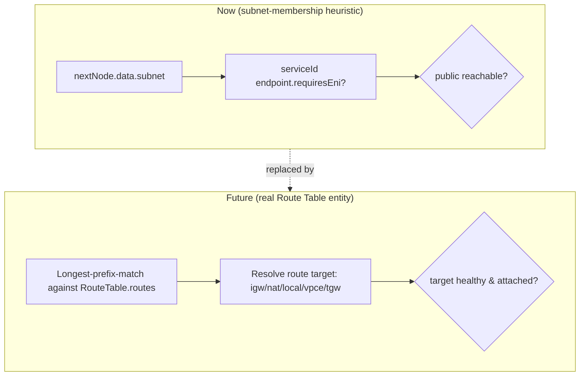

# Network Engine

Status: design only. Implements the AWS networking rules catalogued in
`docs/aws-behavior/NETWORKING_BEHAVIOR.md` and the gaps in `docs/audit/NETWORKING_GAPS.md`, as a
single, generic evaluation pipeline — never a per-service special case.

## 1. Pipeline


This is the same order real traffic experiences in AWS and the same order
`AWS_BEHAVIOR_MODEL.md`/`NETWORKING_BEHAVIOR.md` document per-primitive: a stateless NACL is
evaluated before a stateful Security Group (`NETWORKING_BEHAVIOR.md` §9's evaluation-order note),
and both are evaluated before the target service ever sees the request. IAM sits after the network
layers and before service behavior, matching `IAM_BEHAVIOR.md` §15's placement of resource-level
network reachability as a precondition to policy evaluation, not a substitute for it.

## 2. Mapping to existing code

| Stage | Today | Target |
|---|---|---|
| Source resolution | Implicit: `currentNode` in `runSimulation`'s loop | `Resource` derived for the current hop (`DOMAIN_MODEL.md` §2) |
| Destination resolution | `outgoingEdges` / `downstreamNodes`, computed once per hop in `runSimulation` | Unchanged — already generic, not service-specific |
| Route resolution | Implicit: `networkPathAdapter`'s IGW/NAT/VPC-endpoint checks, keyed by serviceId arrays | New explicit stage, initially a thin wrapper over the same checks; becomes real `RouteTable` lookup only in Phase 4 (`DOMAIN_MODEL.md` §6) |
| NACL | `checkNetworkFirewalls(...).nacl`, `checkCustomNaclReturn` — `networkFirewalls.ts` | Reused verbatim — this stage is already correctly isolated and already fixed for implicit-deny (refactor item 1) |
| Security Group | `checkNetworkFirewalls(...).securityGroup` | Reused verbatim |
| Service endpoint | Split across `vpcEndpointAdapter`, `natGatewayHop.ts`, and serviceId checks in `networkPathAdapter` | Consolidated behind `ServiceEndpointCapabilities` (`DOMAIN_MODEL.md` §9) |
| IAM authorization | None | New — see `IAM_ENGINE.md` |
| Service behavior | `computeCapacityAdapter`, `loadBalancerAdapter`, `dataTierInteractionAdapter`, `cloudFrontAdapter` | See `SERVICE_ENGINE.md` |
| Response / Return path | Post-loop stateless-NACL-return check + response-journey step in `runSimulation` | Reused verbatim — already generic |

## 3. The core change: declarative endpoints, not serviceId arrays

Today, `networkPathAdapter.ts` hardcodes:

```ts
const VPC_HOSTED_INGRESS_SERVICE_IDS = ['alb', 'nlb', 'api_gateway', 'app_runner', 'ec2', 'ecs', 'fargate'];
const INGRESS_PROXY_SERVICE_IDS = ['alb', 'nlb', 'api_gateway', 'cloudfront'];
const MANAGED_EVENT_TARGET_SERVICE_IDS = ['lambda', 'sns', 'sqs', 'eventbridge', 'step_functions'];
const ENDPOINT_SERVICE_IDS = ['privatelink', 's3_gateway_endpoint'];
```

and `containment.ts` hardcodes:

```ts
export const SUBNET_REQUIRED_SERVICE_IDS = ['alb', 'nlb', 'elb', 'app_runner', 'ec2', 'ecs', 'fargate', 'rds', 'aurora', 'elasticache', 'privatelink'];
```

Every one of these lists answers the same underlying question — "what kind of network endpoint is
this service?" — with a different, independently-maintained array. Adding a new VPC-hosted service
means finding and updating up to four lists, and missing one is exactly the class of bug the audit
caught (`SERVICE_GAPS.md`'s NLB-never-evaluated-for-target-health finding, and the pre-fix
`privatelink` subnet-placement gap).

**Target:** one `ServiceEndpointCapabilities` block per service, defined once in `serviceCatalog.ts`
next to that service's other static facts, and consulted everywhere instead of re-checked:

```ts
// serviceCatalog.ts, additive per-service field
createService('alb', 'Application Load Balancer', 'Networking & Content Delivery', ..., {
  endpoint: { requiresEni: true, isIngressProxy: true, isManagedEventTarget: false, isVpcEndpoint: null }
})
```

`containment.ts`'s `SUBNET_REQUIRED_SERVICE_IDS.includes(serviceId)` becomes
`catalogEntry.endpoint.requiresEni`. `networkPathAdapter`'s four arrays collapse to four field reads
on the same struct. This is not a behavior change — every current array membership becomes the
corresponding capability flag's initial value, verified 1:1 against the current arrays as an explicit
migration-step test (`MIGRATION_PLAN.md` Phase 3).

## 4. Route resolution (Phase 4 — reserved, not implemented)

`NETWORKING_BEHAVIOR.md` §§6–7 document Route Tables and Routes as real AWS constructs the simulator
currently has no entity for (`NETWORKING_GAPS.md`: HIGH/MISSING and MEDIUM/MISSING, both flagged as
defensible scope choices, not bugs). The Network Engine reserves an explicit "Route resolution" stage
precisely so this can be filled in later without re-shaping the pipeline:



Until Phase 4, "Route resolution" is a named pass-through to the exact same subnet-boundary +
capability-flag logic `networkPathAdapter` already runs — introducing the stage boundary now, with a
no-op body, is what makes the later swap additive instead of another full rewrite.

## 5. NACL / Security Group stages

No design change — `networkFirewalls.ts` already models these as two independent, correctly-ordered
layers (`FirewallCheckResult.nacl` evaluated first, `securityGroup` only reached if the NACL passed),
already fixed for implicit-final-deny (refactor item 1), already supports the union-across-multiple-
attached-groups semantics real Security Groups have (`checkNetworkFirewalls`'s `configuredGroups`
handling). The Network Engine's NACL/SG stages are literally `checkNetworkFirewalls` called at the
right point in the pipeline — this document names the stage; it does not change the function.

## 6. Service endpoint stage — Gateway vs. Interface VPC Endpoints

Formalizes the distinction `containment.ts`'s comment already documents (`s3_gateway_endpoint` has no
ENI and is a free route-table/prefix-list construct; `privatelink` is billed, ENI-based, and subject
to Security Groups — `NETWORKING_BEHAVIOR.md` §11a/§11b). `ServiceEndpointCapabilities.isVpcEndpoint`
(`'gateway' | 'interface' | null`) replaces the current `ENDPOINT_SERVICE_IDS` array plus the
`!isGatewayEndpoint` gate already added to `vpcEndpointAdapter.ts` in refactor item 10 — same
behavior, one flag instead of a string-array-membership-plus-boolean.

## 7. What does NOT change

- `checkNetworkFirewalls` / `checkCustomNaclReturn` signatures and behavior.
- The hop-by-hop traversal loop in `runSimulation` (owned by the Request/Flow Engine, not this one).
- `deriveSubnetForNode`'s geometric containment algorithm (`containment.ts` §"Finds which subnet...")
  — Route resolution consults its result, it doesn't replace it, until Phase 4 introduces a real
  `RouteTable` (and even then, subnet containment still decides which route table a resource uses,
  matching real AWS's subnet→route-table association).
