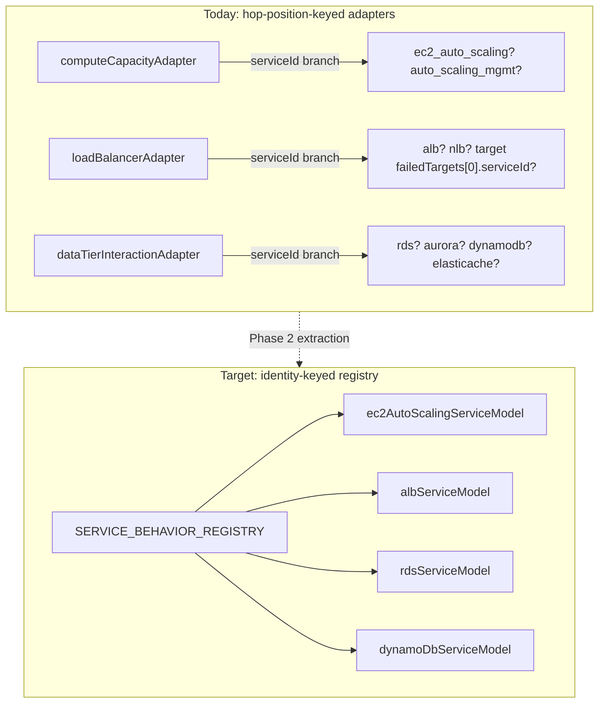

# Service Behavior Engine

Status: design only. Formalizes the per-service processing logic that already exists — split across
`computeCapacityAdapter`, `loadBalancerAdapter`, `dataTierInteractionAdapter`, `cloudFrontAdapter`,
and `natGatewayHop.ts` — behind one common interface, so adding a new service's behavior means adding
one module, not editing a shared adapter's conditional branches.

## 1. The interface

Adapted from the prompt's suggested `AWSServiceModel` shape to match what the codebase actually needs
at each pipeline stage (`NETWORK_ENGINE.md` §1's "Service endpoint" and "Service behavior" boxes):

```ts
interface AWSServiceModel {
  /** Called once, at architecture-load / validation time — not per-hop. */
  validateConfiguration(resource: Resource): ConfigIssue[];

  /** Called by the Network Engine's "Service endpoint" stage. */
  resolveEndpoints(resource: Resource): ServiceEndpointCapabilities;

  /** Called by the Network Engine before a hop is allowed to reach this service. */
  canReceive(resource: Resource, packet: Packet): boolean;

  /** Called when this service is the source of an outgoing hop (e.g. Lambda invoking DynamoDB). */
  canSend(resource: Resource, packet: Packet): boolean;

  /** The actual per-service behavior: auto-scaling, cache lookup, target-health routing,
   *  failover, etc. Returns a Decision, exactly like today's AdapterSignal. */
  processRequest(resource: Resource, ctx: AdapterContext): Decision;

  /** Static, catalog-sourced — already exists as AWSService.dependencies. */
  getDependencies(resource: Resource): string[];

  /** Static, catalog-sourced — already exists as AWSService.failureModes. */
  getFailureModes(resource: Resource): FailureMode[];
}
```

This is explicitly **adapted, not copied verbatim** from the prompt's suggestion, per its own
instruction: `getDependencies`/`getFailureModes` are thin wrappers over data the catalog
(`serviceCatalog.ts`) already stores per service — no new logic needed, just a consistent method to
read it through. `validateConfiguration` formalizes checks that exist today only as ad hoc UI-side
validation (e.g. subnet-placement errors currently raised inline in `runSimulation`, refactor item
covered structurally, not moved yet — see `MIGRATION_PLAN.md` Phase 2).

## 2. Registry shape: keyed-by-serviceId, like `costCalculator.ts`

`processRequest` implementations are independent of each other — ALB's behavior module doesn't need
to know DynamoDB's — exactly like `costCalculator.ts`'s `PRICING_MODULE_ENTRIES` registry, and unlike
the *outer* pipeline (Network → IAM → Service → Failure), which stays an ordered sequence
(`SIMULATION_ENGINE_ARCHITECTURE.md` §3, "order matters where order matters").

```ts
const SERVICE_BEHAVIOR_REGISTRY: Record<string, AWSServiceModel> = {
  alb: albServiceModel,
  nlb: nlbServiceModel,           // today folded into loadBalancerAdapter's shared LB logic
  ec2_auto_scaling: ec2AutoScalingServiceModel,
  auto_scaling_mgmt: ecsAutoScalingServiceModel,
  cloudfront: cloudFrontServiceModel,
  rds: rdsServiceModel,
  aurora: auroraServiceModel,
  dynamodb: dynamoDbServiceModel,
  // ...one entry per service with non-generic behavior; services with no special behavior
  // (the ~16/28 flagged in SERVICE_GAPS.md as "generic undifferentiated failure behavior")
  // simply have no entry and fall through to a default pass-through model.
};
```



## 3. What moves, what doesn't

| Existing adapter | Network mechanics (stays in Network Engine) | Service behavior (moves to registry) |
|---|---|---|
| `computeCapacityAdapter` | — | Auto-scaling/saturation decision logic (`ec2_auto_scaling` vs. `auto_scaling_mgmt` branching) |
| `loadBalancerAdapter` | Firewall check via `pushFirewallBlockIfAny` | Target-health evaluation, 503-on-no-healthy-targets, ASG-vs-ECS-scheduler narration |
| `dataTierInteractionAdapter` | — | Multi-AZ failover / cache-fallback decisions (the `markSuccess`-without-status-code behavior, `SimulationTrace` §3 of `TRACE_ENGINE.md`) |
| `cloudFrontAdapter` | — | Cache-hit/miss behavior |
| `vpcEndpointAdapter` | Firewall check, gateway-vs-interface distinction | (No independent service behavior beyond routing — this adapter stays mostly Network Engine) |
| `natGatewayHop.ts` | NAT translation / outbound-only directionality | (Same — this is a network primitive, not a "service" with independent behavior; stays in Network Engine, not the registry) |
| `terminalNode.ts`, `perimeterInspection.ts`, `networkPath.ts` | Structural checks and the catch-all resolver | (Mostly Network Engine / Decision Engine glue, not service-specific) |

Note this split is deliberately conservative: `natGatewayHop` and most of `vpcEndpointAdapter` stay
Network Engine concerns, not Service Behavior Engine ones, because NAT/VPC-endpoint routing is a
networking primitive's behavior (documented in `NETWORKING_BEHAVIOR.md`), not an individual AWS
service's behavior (documented in `SERVICE_BEHAVIOR.md`). Only the adapters whose logic branches on
"which service is this, specifically" (compute capacity, load balancer, data tier, CloudFront) move.

## 4. `getFailureModes` and the three-health-system finding

`FAILURE_BEHAVIOR.md`'s headline finding — ELB target-health, ASG health, and ECS-scheduler health
are three independent AWS systems the simulator currently conflates in narration — becomes a real,
queryable fact once `getFailureModes` returns a `detectionSystem` tag per failure mode
(`DOMAIN_MODEL.md` §11):

```ts
ec2AutoScalingServiceModel.getFailureModes = () => [
  { id: 'asg-unhealthy-instance', serviceId: 'ec2_auto_scaling', description: 'Instance fails ASG health check, is terminated and replaced', detectionSystem: 'asg_health_check' }
];
albServiceModel.getFailureModes = () => [
  { id: 'alb-no-healthy-targets', serviceId: 'alb', description: 'All registered targets fail target-group health checks', detectionSystem: 'elb_health_check' }
];
```

This lets `loadBalancerAdapter`'s (soon: `albServiceModel.processRequest`'s) narration branch on
`detectionSystem` instead of re-deriving "is this an ASG or an ECS service" from
`failedTargets[0].data.serviceId` string comparison every time — same fix already landed for refactor
item 11, now backed by real per-service data instead of an inline branch.

## 5. What does NOT change

- `AWSService` (`serviceCatalog.ts`) stays the single source of static per-service facts
  (`dependencies`, `failureModes`, `resilienceCharacteristics`, ...) — `getDependencies`/
  `getFailureModes` read it, they don't duplicate it.
- The registry pattern is proven already (`costCalculator.ts`'s `PRICING_MODULE_ENTRIES`) — this is
  applying the same pattern to a second axis (simulation behavior) of the same per-service data, not
  inventing a new one.
- Services with no entry in `SERVICE_BEHAVIOR_REGISTRY` behave exactly as they do today: pass through
  the generic network-path resolution with no service-specific processing. This is explicitly not a
  requirement to write 28 behavior modules up front — the registry grows as gaps are prioritized
  (`SERVICE_GAPS.md`'s "generic undifferentiated failure behavior for ~16/28 services" finding is
  MEDIUM, not a blocker for this design).
