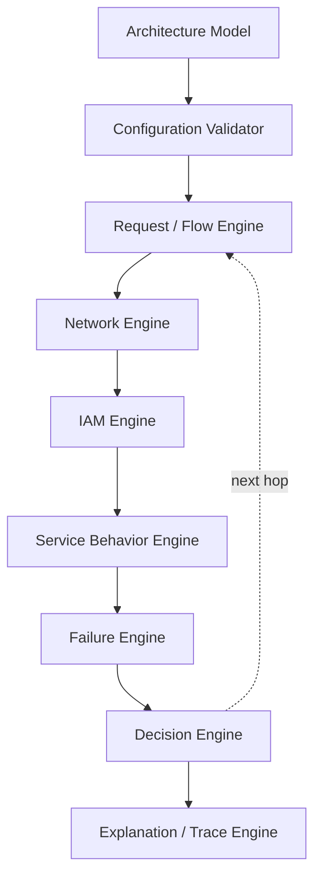

# Simulation Engine Target Architecture

Status: **design only — nothing in this document has been implemented.** It defines where the
simulator should end up after the work catalogued in `docs/audit/PRIORITIZED_REFACTOR_PLAN.md`
items 13–14, plus the structural cleanup items 1–12 already completed. This is not a rewrite
proposal: every stage below already has a real, working, partial counterpart in the codebase
today, and the migration path (`MIGRATION_PLAN.md`) is written to grow the existing code into
this shape incrementally, never to replace it with a parallel implementation.

## 1. Why restructure at all

The current engine (`src/engine/simulation/`) is already past its first refactor: `requestSimulator.ts`
was reduced from one large serviceId-keyed conditional chain into an **ordered pipeline** of nine
named adapters (`src/engine/simulation/adapters/`), each independently readable and testable. That
refactor solved the "giant function" problem. It did not solve three deeper structural problems the
audit surfaced (`docs/audit/SIMULATION_GAPS.md`, `NETWORKING_GAPS.md`, `IAM_GAPS.md`):

1. **Networking logic is still embedded inside the traversal adapters, not owned by a dedicated
   network model.** `networkPathAdapter` alone knows about IGW attachment, NAT/VPC-endpoint egress,
   and public/private subnet blocking, all encoded as serviceId string-array membership tests
   (`VPC_HOSTED_INGRESS_SERVICE_IDS`, `INGRESS_PROXY_SERVICE_IDS`, ...). Adding a new networking
   primitive (Route Tables, VPC Peering, Transit Gateway — see `NETWORKING_BEHAVIOR.md` §§6–7,
   13–14) means editing this adapter's control flow again, not registering new declarative data.
2. **There is no IAM model at all** (`IAM_GAPS.md` — every construct rated MISSING). Authorization
   is not evaluated anywhere in the request path; the presence of an IAM node on the canvas is
   purely decorative. This isn't a gap in one adapter — it's a whole missing stage of the pipeline.
3. **Per-service behavior and per-hop network mechanics are interleaved.** `computeCapacityAdapter`,
   `loadBalancerAdapter`, `dataTierInteractionAdapter`, `cloudFrontAdapter`, and `vpcEndpointAdapter`
   are each a mix of "what does this specific service do" (service behavior) and "how does a packet
   reach it" (network mechanics). Today that's fine because the two concerns are simple enough to
   co-locate. It stops being fine once IAM authorization, route resolution, and richer failure modes
   all need to consult the same per-hop context independently.

The target architecture pulls these three concerns into their own explicit stages, each with a
narrow, testable responsibility, while keeping the ordered-pipeline shape that already works.

## 2. Target pipeline

Reading this as a per-hop loop (not a one-shot pipeline) matters: stages C–H run once per hop in the
traversal, exactly like today's `while (currentNode)` loop in `runSimulation`. The Trace Engine is
the one stage that accumulates across the whole run rather than resetting each hop — it already
exists in this exact role as `SimulationTrace`.

| Stage | Responsibility | Today's counterpart | Status |
|---|---|---|---|
| Architecture Model | The canvas graph: nodes, edges, boundaries | `Node<ServiceNodeData>[]`, `Edge<ConnectionData>[]`, `boundaryNode`s | Exists, reused as-is |
| Configuration Validator | Structural checks that don't depend on a specific request | Scattered: `deriveSubnetForNode`, node-health checks inlined in `runSimulation` | Partially exists, scattered |
| Request / Flow Engine | Resolves start node, owns the hop loop, cycle guard, orchestrates the per-hop stages | `runSimulation`'s loop scaffold | Exists |
| Network Engine | Source/destination/route resolution, NACL, Security Group, endpoint reachability | `networkFirewalls.ts`, `containment.ts`, parts of `networkPathAdapter`/`vpcEndpointAdapter`/`natGatewayHop.ts` | Partially exists, embedded in adapters |
| IAM Engine | Principal/Action/Resource/Condition authorization | **Nothing** | Does not exist (`IAM_GAPS.md`) |
| Service Behavior Engine | Per-service processing: auto-scaling, load-balancer routing, cache behavior, data-tier failover | `computeCapacityAdapter`, `loadBalancerAdapter`, `dataTierInteractionAdapter`, `cloudFrontAdapter` | Exists, but tangled with network mechanics |
| Failure Engine | Health state, failure-mode selection, cascade propagation | `NodeHealth`/`failureReason` fields, `CASCADING_FAILURE_STAGES` narrative (UI-only, disconnected — `FAILURE_GAPS.md` #1) | Exists partially, disconnected from live simulation |
| Decision Engine | Combines network + IAM + service + failure verdicts into one hop outcome (advance / terminate / retry) | The adapter-loop's `AdapterSignal` (`continue`/`advance`/`terminate`) | Exists in miniature |
| Explanation / Trace Engine | Structured, replayable step log | `SimulationTrace`, `SimulationStep` | Exists, needs schema enrichment (see `TRACE_ENGINE.md`) |

## 3. Design principles carried over from the existing codebase

These aren't new ideas — they're the same principles that made the `costCalculator.ts` pricing-module
registry and the `adapters/` pipeline extraction succeed, applied one level deeper:

- **Behavior-preservation is the acceptance bar.** Every phase in `MIGRATION_PLAN.md` must leave the
  existing 50-test suite passing unchanged, exactly as items 1–12 of the refactor plan did.
- **Order matters where order matters, and nowhere else.** The Service Behavior Engine's per-service
  modules are independent (like `PRICING_MODULE_ENTRIES` — a flat registry keyed by serviceId). The
  outer pipeline (Network → IAM → Service Behavior → Failure → Decision) is NOT independent and stays
  an explicit ordered sequence, exactly like `SIMULATION_PIPELINE` today.
- **No new parallel architecture model.** `Node<ServiceNodeData>[]` / `Edge<ConnectionData>[]` remain
  the one source of truth the UI reads and writes. Every new domain type (`DOMAIN_MODEL.md`) is either
  a derived read-only view over this data or a small additive field on an existing type — never a
  second graph the UI would need to stay in sync with.
- **Metadata must drive behavior, not just describe it.** The single biggest audit finding
  (`IAM_GAPS.md`, the Thumbnail Generator's decorative `node-iam`) was a node whose presence implied a
  behavior the engine never actually evaluated. The IAM Engine's entire purpose is closing exactly
  this gap — once it exists, an IAM node's policies are read and applied, not just displayed.
- **Every AWS-behavioral rule this system encodes must trace back to `docs/aws-behavior/`.** Each
  engine's design doc below cites the specific section of `NETWORKING_BEHAVIOR.md` / `IAM_BEHAVIOR.md`
  / `SERVICE_BEHAVIOR.md` / `FAILURE_BEHAVIOR.md` it implements, so a future reviewer can check the
  code against the documented AWS rule directly.

## 4. Non-goals

- **Not a rewrite.** `runSimulation`, the adapter pipeline, `networkFirewalls.ts`, and
  `costCalculator.ts` all stay in place through most of the migration; later phases grow new
  engines alongside them and only fold old logic in once the new engine's behavior is proven
  equivalent by tests.
- **Not a new UI.** Every existing component (`SimulationControls`, `EventTimeline`,
  `NodeStatusModal`, the failure-mode components) keeps reading `SimulationResult`/`SimulationStep`
  exactly as shaped today. Any new fields are additive and optional.
- **Not full route-table/BGP-level networking.** Transit Gateway and VPC Peering remain documented
  (`NETWORKING_BEHAVIOR.md` §§13–14) but explicitly out of scope for implementation per the original
  refactor plan's item-13 scope boundary — the Network Engine is designed to be *extensible* to them
  later, not to model them now.
- **Not a general-purpose policy language.** The IAM Engine models the specific evaluation order and
  constructs enumerated in `IAM_BEHAVIOR.md` (Principal/Action/Resource/Condition/Identity policy/
  Resource policy/Trust policy/Explicit deny/Permissions boundary/SCP), not arbitrary IAM JSON policy
  documents with wildcards, variables, or every condition operator AWS supports.

## 5. Document map

| File | Covers |
|---|---|
| `DOMAIN_MODEL.md` | Every core type (Architecture, Resource, Principal, ... SimulationTrace), and exactly how each maps onto (or extends) an existing type in `src/types/index.ts` |
| `NETWORK_ENGINE.md` | The Source→Destination→Route→NACL→SG→Endpoint pipeline, replacing serviceId-array checks with declarative endpoint capabilities |
| `IAM_ENGINE.md` | The Principal/Action/Resource/Context → policies → deny → allow → conditions evaluator |
| `SERVICE_ENGINE.md` | The `AWSServiceModel`-shaped interface, adapted from the existing per-service adapters and the `costCalculator` registry pattern |
| `TRACE_ENGINE.md` | The step/component/decision/reason/rule/evidence trace schema, as an additive extension of `SimulationStep` |
| `FAILURE_ENGINE.md` | Health state, failure-mode catalog, and cascade propagation, unifying today's disconnected `CASCADING_FAILURE_STAGES` narrative with live simulation |
| `MIGRATION_PLAN.md` | The phased, test-gated path from today's code to this target, with explicit backward-compatibility guarantees per phase |
